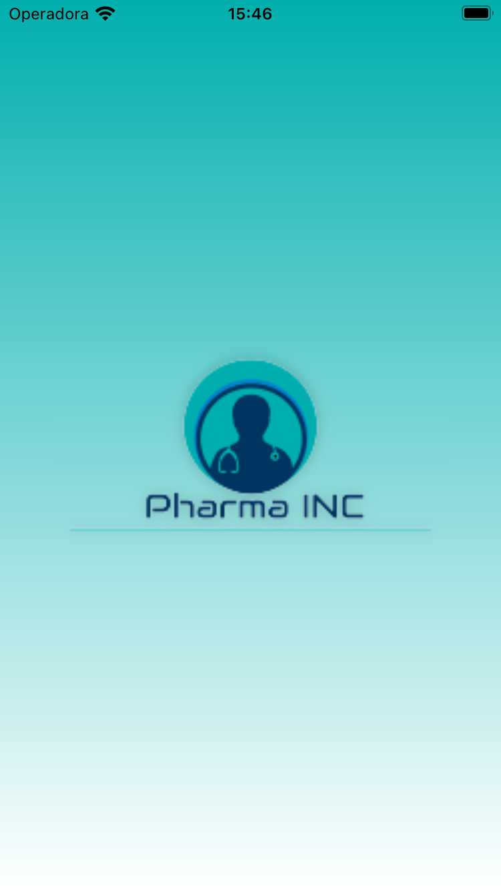
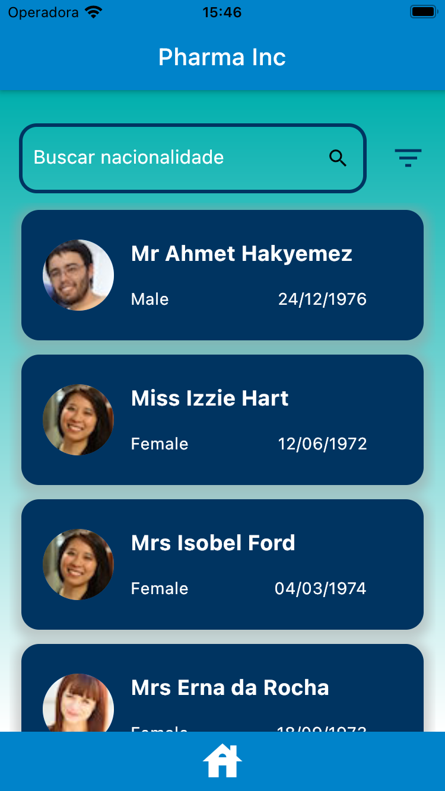
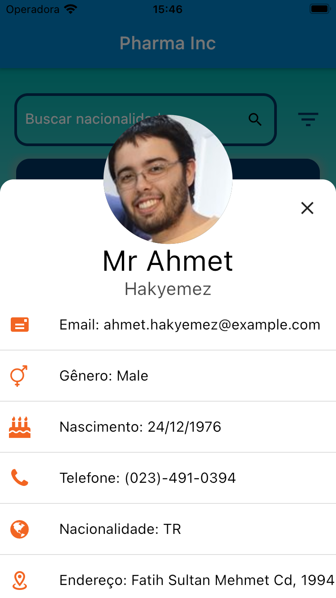

### *challenge by coodesh*

<h1 align="center">

</h1>

<p float="left"  align="center">
  
   
  
</p>

---
## 🔖 Sobre

- O projeto **PharmaInc** é um aplicativo para apresentar um banco de dados de clientes, com filtros por nacionalidade e gênero, lista com loading automático e detalhes do cliente, proposto como desafio pelo *Coodesh*.
---
## 🚀 Tecnologias

- Dart(Flutter)
---
## Instalação

```bash
$ git clone https://github.com/Robertrodrigues000/desafio-pharma-inc.git

$ cd desafio-pharma-inc

$ flutter run lib/main.dart

```